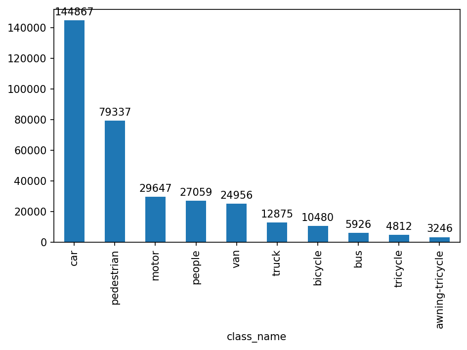
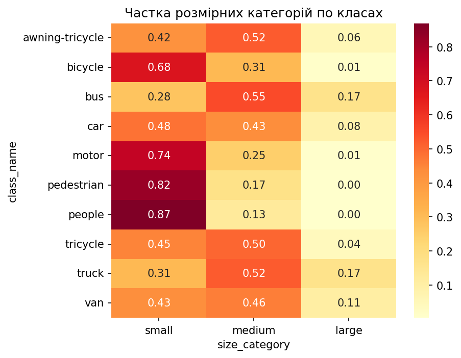
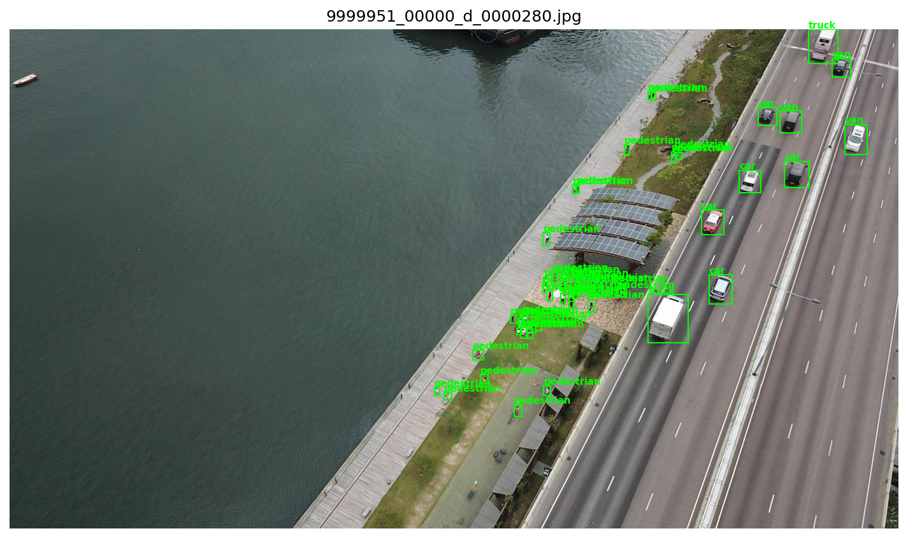

# Детекція об'єктів на аерознімках з БпЛА (VisDrone)

## Мотивація та аналіз ринку
Детекція дрібних об'єктів на аерознімках — задача релевантна і для розвідки (ISR), і для counter-UAV

Аналіз вакансій CV-інженерів в українському мілтеху (DOU DefTech, Djinni miltech)
показує три домінуючі вимоги: YOLO-família для real-time детекції на борту,
оптимізація під edge (ONNX/TensorRT, квантування, Jetson), робота з аеро- та
супутниковими знімками. Цей проєкт цілиться в перші дві: детекція дрібних об'єктів
на аерознімках VisDrone + бенчмарк оптимізованих версій моделі.

Повний аналіз ринку: [reports/market_analysis.md](reports/market_analysis.md)

## Задача
Multi-class object detection на аерознімках. 

Метрики
**Основна: mAP@50** - стандарт для детекції об'єктів, усереднює AP по 10 класам з порогом IoU 0,5. Обрана саме ця метрика бо поріг у 0,5 оптимальніший для датасету де 61% об'єктів є дрібними.

**Допоміжна: mAP@50-95** (точність локалізації), recall (критичний для ISR-задач:
пропущена ціль дорожча за хибне спрацювання), inference time / FPS
(edge-обмеження).

## Дані
[VisDrone2019-DET](https://github.com/VisDrone/VisDrone-Dataset) — аерознімки з БпЛА.
- Train: 6 471 зображень, 343 204 анотованих об'єкти
- Val: 548 зображень, 38 759 об'єктів
- 10 класів: pedestrian, people, bicycle, car, van, truck, tricycle, awning-tricycle, bus, motor
- Роздільності: від 960×540 до 2000×1500 (11 варіантів)

## Підхід
Baseline: zero-shot YOLOv8n (COCO). Моделі: ...

## Обмеження / нотатки до вимірювань
Zero-shot baseline вимірюється з обмеженням: словник класів COCO (80) не збігається з VisDrone (10), індекси класів не вирівняні, тому per-class метрики baseline некоректні. Показник відображає загальну непридатність COCO-моделі до аеродомену, а не точну оцінку по кожному класу. Коректне вимірювання потребувало б мапінгу перетину класів (person↔pedestrian, car↔car, bus↔bus...)

Датасет має вбудований bias. Модель, натренована на VisDrone, бачитиме більше прикладів об'єктів у центрі кадру — і потенційно гірше працюватиме на об'єктах з периферії в реальному застосуванні.

EDA етап
1. Екстремальний дисбаланс класів (45:1)
car — 144 867 екземплярів, awning-tricycle — 3 246. Корелює з per-class AP: car 0.331, awning-tricycle 0.00002.

2. Висока щільність об'єктів
Медіана 42 об'єкти/кадр проти ~7 у COCO (у 6 разів більше). 11% зображень містять понад 100 об'єктів, максимум — 902. Пояснює виміряну аномалію: постобробка (4.7 ms) втричі довша за інференс (1.8 ms).

3. Домінування дрібних об'єктів
60.5% об'єктів — small (<32² px), лише 5.5% — large. Після ресайзу до 640 типовий small-об'єкт стає ~10×10 px і покривається 1–2 клітинками найдрібнішої сітки (stride 8) — на межі роздільної здатності архітектури.

4. Два незалежні фактори складності класу
Порівняння bicycle (10 480 екз., 68% small, AP 0.0009) і bus (5 926 екз., 28% small, AP 0.063): попри вдвічі меншу представленість, bus детектується значно краще. Отже, частота і розмір впливають окремо, і потребують різних стратегій виправлення.

5. Просторова нерівномірність
Щільність у центрально-верхній зоні кадру ~10× вища, ніж біля нижнього краю. Причина — наведення камери оператором і нахил зйомки. Наслідок: обережність з crop-аугментаціями + вбудований bias датасету.

6. Візуальний аудит (якісні спостереження)
pedestrian vs people розрізняються за позою, яку з висоти майже не видно
bicycle vs motor нерозрізненні людським оком на нічних кадрах
car vs van відрізняються лише розміром — очікувана плутанина
tricycle трапився один раз на 12 переглянутих зображень

## Гіпотези для перевірки
H1: збільшення imgsz з 640 до 960 дасть непропорційно великий приріст саме на дрібних класах (bicycle, motor, pedestrian)
H2: збільшення max_det з 300 до 1000 підвищить recall на щільних кадрах
H3: рідкісні класи (awning-tricycle, bus) залишаться проблемними навіть при довгому тренуванні через дисбаланс

## Що покращити далі
Перенесення пайплайну на counter-UAV датасет (детекція БпЛА в небі) — релевантно для задач протидії ворожим дронам
Трекінг об'єктів (ByteTrack) на відеопотоці
Деплой на NVIDIA Jetson з TensorRT (у проєкті обмежились ONNX/INT8)
Коректний zero-shot baseline з мапінгом класів COCO↔VisDrone
Робота з дисбалансом: class weights, oversampling рідкісних класів, focal loss
Streamlit/Gradio демо

## Результати

| Модель | Параметри | val mAP50 | val mAP50-95 | Inference (ms) | Час тренування | Гіпотеза\Мета |
|-------------------------------------|-----------------------------------:|-----------:|------:|----:|--:|
| Baseline: YOLOv8n (COCO, zero-shot) | без тренування                     | 0.016      | 0.007 | 3.1 | 0 |
| YOLOv8n fine-tuned                  | epochs=1, imgsz=640, batch=16      | 0.115      | 0.059 | 1.8 |   |
| YOLOv8n fine-tuned                  | epochs=10, imgsz=640, batch=16     | 0.2345     | 0.131 |  |  27.6 |
| YOLOv8n fine-tuned                  | epochs=25, imgsz=640, batch=16     | 0.2724     | 0.153 | 0.0 |  68.10 |
| YOLO11s fine-tuned                  | epochs=25, imgsz=640, batch=16     | 0.3622     | 0.210 | 0.0 |  74.46 |

## Висновки
[в кінці]

## Installation & Usage
[в кінці]